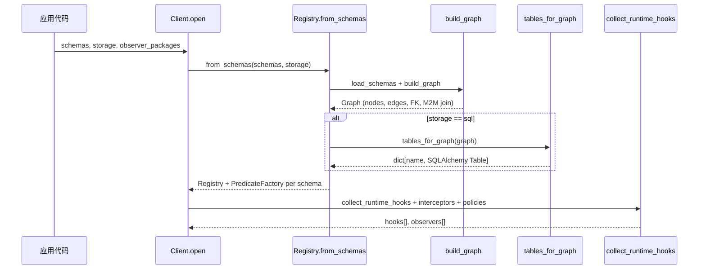
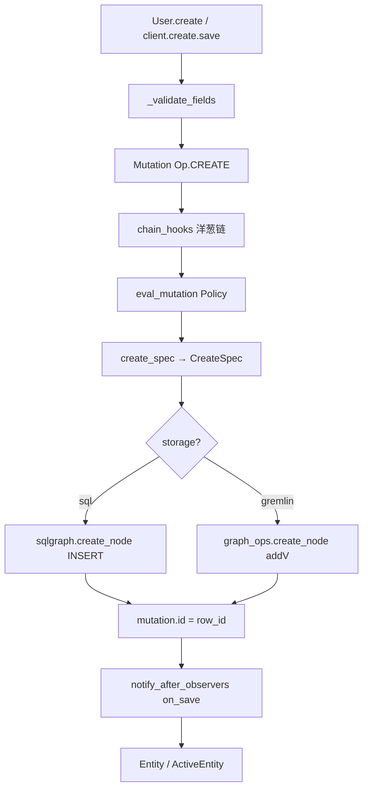
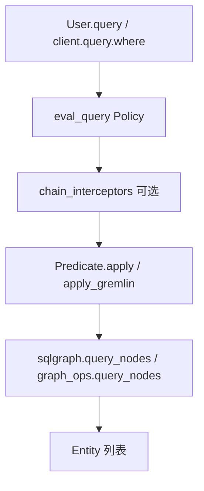
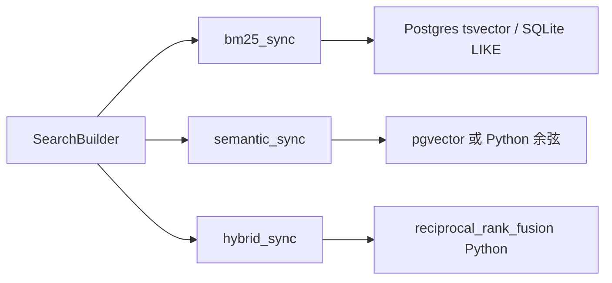
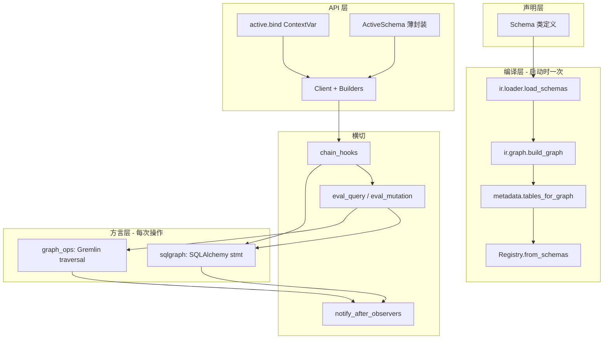

# entpy 架构设计与端到端执行流程

本文档描述 entpy 的分层架构、启动编译流程、CRUD/遍历/检索的端到端路径，以及谓词如何下推为 SQL/Gremlin。

## 1. 设计目标与总体分层

entpy 是 **运行时优先（runtime-first）** 的实体框架：用 Python 类声明 Schema，启动时编译为中间表示（IR），再通过 `Client` / `ActiveSchema` 执行 CRUD、图遍历与检索。**不生成 ORM 代码**，Schema 即唯一数据源。

```
┌─────────────────────────────────────────────────────────────────┐
│  声明层 (Declarative)                                            │
│  schema/   Field、Edge、BaseSchema、SearchMixin、@hook、Policy   │
├─────────────────────────────────────────────────────────────────┤
│  编译层 (IR)                                                     │
│  ir/       Schema → NodeDescriptor → Graph（表/FK/M2M/Gremlin 标签）│
├─────────────────────────────────────────────────────────────────┤
│  注册层 (Registry)                                               │
│  runtime/registry   Graph + SQLAlchemy Table + PredicateFactory  │
├─────────────────────────────────────────────────────────────────┤
│  API 层                                                          │
│  active/   bind() + ActiveSchema（ContextVar 隐式 Client）        │
│  runtime/  Client + Builders + Predicate + Traverse            │
├─────────────────────────────────────────────────────────────────┤
│  横切能力                                                        │
│  observer/  生命周期钩子（自动发现）                              │
│  privacy/   Allow / Deny / Skip 策略链                           │
│  entql/     JSON 过滤器 → Predicate                              │
│  search/    BM25 / 向量 / RRF 混合                               │
├─────────────────────────────────────────────────────────────────┤
│  方言层 (Dialect)                                                │
│  dialect/sqlalchemy/   sqlgraph → INSERT/SELECT/UPDATE/DELETE  │
│  dialect/gremlin/      graph_ops → addV/addE/遍历                │
└─────────────────────────────────────────────────────────────────┘
```

| 层 | 目录 | 核心职责 |
|----|------|----------|
| Schema | `entpy/schema/` | DSL：字段类型、边、索引、检索配置、Mixin hooks |
| IR | `entpy/ir/` | 将 Schema 类解析为 `NodeDescriptor` 与 `Graph` |
| Registry | `entpy/runtime/registry.py` | 持有 Graph、SQL 表元数据、每 Schema 的 `F()` 工厂 |
| Runtime | `entpy/runtime/` | CRUD 构建器、谓词、遍历、Mutation |
| Active | `entpy/active/` | `bind()` 绑定 Client；`User.create()` 语法糖 |
| Observer | `entpy/observer/` | `creating` / `on_save` 等，转成 Hook 或后置回调 |
| Dialect | `entpy/dialect/` | 真正访问数据库 |

---

## 2. 启动与编译流程

`Client.open()` / `bind()` 打开连接时，**一次性**完成 Schema → 可执行结构的编译：



关键入口：`Registry.from_schemas()`（`entpy/runtime/registry.py`）：

1. `build_graph(schemas)` — 解析边、FK、M2M join 表
2. `tables_for_graph(graph)` — 仅 SQL 存储时生成 `SQLAlchemy Table`
3. 为每个 Schema 构建 `PredicateFactory`（字段名 → 列名）

**编译产物：**

- `Graph`：节点名、边类型（O2O/O2M/M2M）、FK 列、join 表
- `tables`（仅 SQL）：含 UUID 主键、`create_time` / `delete_time` 等列
- `PredicateFactory`：供 `F(User).age` 使用

---

## 3. ActiveSchema 与 Client 的关系

`ActiveSchema` **不重复实现**持久化逻辑，只是从 `ContextVar` 取出当前 `Client` 并委托给 Builder（`entpy/active/schema.py`）。

| 能力 | Active API | 底层等价 |
|------|------------|----------|
| 创建 | `User.create(name="x")` | `client.create(User, name="x").save()` |
| 查询 | `User.query(age=18)` | `client.query(User).where(F(User).age.eq(18))` |
| 谓词 | `F(User)` via `get_client().F(User)` | `client.F(User)` |
| 遍历 | `e.out("knows").out("knows")` | `client.traverse(e, "knows")` |

**约束：** `ActiveSchema` 必须在 `with bind(...):` 块内使用，否则 `get_client()` 抛错。

---

## 4. 谓词是否「转 SQL」？

**结论：会下推到数据库，但不是字符串拼接 SQL，而是编译为 SQLAlchemy 表达式 / Gremlin 遍历步骤。**

### 4.1 谓词模型

`F(User).age.gt(18)` 构建 `Predicate` 对象，内部持有两个闭包（`entpy/runtime/predicate.py`）：

- `fn(table)` → SQLAlchemy 表达式，如 `table.c.age > 18`
- `gremlin_fn(t)` → Gremlin 步骤，如 `t.has("age", P.gt(18))`

当前 `FieldRef` 支持：`eq`、`ne`、`in_`、`gt`（尚无 `lt` / `gte` / `like` 等）。

### 4.2 查询时下推路径

```
client.F(User).age.gt(18)
  → Predicate(fn, gremlin_fn)
  → QueryBuilder._run_query()
  → sql_preds = [p.apply(table) for p in preds]
  → sqlgraph.query_nodes(..., predicates=sql_preds)
  → select(table).where(pred).limit(...)
  → session.execute(stmt)   # SQLAlchemy 编译为参数化 SQL
```

Gremlin 分支对每个 `Predicate` 调用 `apply_gremlin()`，在遍历上追加 `.has()` 等步骤。

**实际 SQL 形态（由 SQLAlchemy 生成，示意）：**

```sql
SELECT users.id, users.name, users.age, ...
FROM users
WHERE users.age > :age_1
LIMIT :param_1
```

### 4.3 EntQL 路径

`QueryBuilder.entql({"age": {"gt": 18}})` → `entql_to_predicates()`（`entpy/entql/filter.py`）→ 同样生成 `Predicate`，之后与 `where()` 相同下推。

### 4.4 不会自动转 SQL 的场景

| 场景 | 行为 |
|------|------|
| 任意 Python 函数过滤 | 不支持；须用 `F()` / EntQL |
| `entity.out().where(...)` 多跳过滤 | 部分在 Python 二次 query |
| Policy / Hook / Observer | 纯 Python |
| Search 的 RRF 融合 | Python 合并排名 |
| 非 PG 环境的语义检索 | Python 暴力余弦（有 pgvector 时才下推） |

---

## 5. 端到端：CREATE



| 步骤 | 位置 | Python / DB |
|------|------|-------------|
| 默认值、validators | `CreateBuilder._validate_fields` | **Python** |
| 修改 fields | `chain_hooks`（含 Observer `creating`） | **Python** |
| 权限检查 | `eval_mutation` | **Python** |
| 构建 INSERT spec | `create_spec()` | **Python** |
| 写库 + 边 | `sqlgraph.create_node` / `graph_ops.create_node` | **DB** |
| 后置回调 | `notify_after_observers` | **Python**（`on_save`） |

边写入（SQL）在 `create_node` 内按关系类型处理：M2M 插 join 表，O2M/O2O 更新对端 FK。

---

## 6. 端到端：QUERY



| 步骤 | Python / DB |
|------|-------------|
| `eval_query`：策略过滤/拒绝 | **Python**（在 DB 前） |
| Interceptor 包装 execute | **Python** |
| `p.apply(table)` → SQLAlchemy WHERE | **编译为 SQL** |
| `select(table).where(...).limit(...)` | **DB** |
| 结果封装为 `Entity` | **Python** |
| `with_("cars")` 预加载边 | **DB**（额外 SELECT） |

**注意：** Query **不经过** Observer；读路径无 `on_save`。

---

## 7. 端到端：UPDATE / DELETE

### UPDATE

与 CREATE 类似：`updating` Hook → Policy → `update_spec` → `UPDATE` SQL / Gremlin `property()` → `notify_after_observers`（`updated` + `on_save`）→ 再 query 一次返回最新行。

### DELETE

- 若只有 `where()` 没有 `one(id)`，会 **先在 Python 里 query 出 id 列表**，再 DELETE
- `chain_hooks` 含 `deleting`
- 成功后 `on_delete`

---

## 8. 端到端：TRAVERSE（边遍历）

入口：`entity.out("knows")` 或 `client.traverse(entity, "knows")` → `TraverseChain`（`entpy/runtime/traverse.py`）

| 模式 | 实现 | 下推程度 |
|------|------|----------|
| SQL 单跳 | `resolve_edge` → FK 谓词 → `query_nodes` | **DB** |
| Gremlin 单跳 | `graph_ops.traverse_neighbors` | **DB** |
| Gremlin 多跳无过滤 | `traverse_chain` 一次遍历 | **DB**（fast path） |
| SQL 多跳无过滤 | `traverse_chain_sql` 单次 JOIN | **DB**（fast path） |
| SQL 多跳 | `all()` 循环 `_hop_neighbors` | **Python 逐跳** |
| 带 `where()` 过滤 | 收集邻居 id → 二次 `QueryBuilder` | **混合** |

图存储与关系库在遍历能力上不对等：Gremlin 多跳可一次下推，SQL 多跳目前是应用层迭代。

---

## 9. 端到端：SEARCH（检索）



| 方法 | 下推 | 说明 |
|------|------|------|
| `bm25_sync` | **DB** | PG `ts_rank` 或 SQLite `LIKE` |
| `semantic_sync` | **DB 或 Python** | 有 pgvector 用距离排序；否则全表拉取向量后 Python 算相似度 |
| `hybrid_sync` | **混合** | 两次检索 + Python RRF 融合 |
| `reindex` | **混合** | query 全表 → embed → `update().set(embedding)` |

检索与 CRUD 共用同一 `Client` 与 `Registry`，但走独立的 `SearchRegistry`（从 `SearchMixin.search_config()` 解析）。

---

## 10. Hook / Observer / Policy 执行顺序

### 10.1 Hook 列表组装（`collect_runtime_hooks`）

```
extra_hooks（Client.open_with 传入）
  + Schema/Mixin 上的 @hook
  + observers_to_hooks()（仅 creating / updating / deleting）
```

### 10.2 变更（CREATE / UPDATE / DELETE）顺序

```
1. _validate_fields()          [仅 CREATE]
2. 构建 Mutation
3. chain_hooks()               ← 洋葱链，持久化前
   └─ Observer creating/updating/deleting
   └─ Schema @hook
4. eval_mutation()             ← Policy 规则链
5. create_spec / update_spec / delete_spec
6. sqlgraph / graph_ops        ← 真正写库
7. notify_after_observers()    ← 持久化后，不在 Hook 链内
   ├─ created/updated/deleted（若子类 override）
   └─ on_save / on_delete
```

`chain_hooks` 采用洋葱模型：列表中的 Hook 从外到内包裹 `_TerminalMutator`，持久化前可修改 `mutation.fields`。

Observer **后置**方法（`created` / `updated` / `deleted` / `on_save` / `on_delete`）在 Hook 链**之外**同步调用，不参与 `chain_hooks`。

### 10.3 查询顺序

```
eval_query(Policy)  →  chain_interceptors  →  execute(SQL/Gremlin)
```

---

## 11. Python 层 vs 数据库层

| 留在 Python | 下推到 DB |
|-------------|-----------|
| 字段默认值、validators | INSERT / UPDATE / DELETE |
| Hook / Observer 修改 mutation | WHERE（Predicate → SQLAlchemy / Gremlin） |
| Policy Allow / Deny / Skip | BM25（PG / SQLite） |
| Delete 先 query 解析 id | pgvector 距离（若有） |
| SQL 多跳 traverse 逐跳 | Gremlin 多跳 fast path |
| Traverse 带 where 二次过滤 | 单跳 FK / Gremlin out |
| Hybrid RRF、非 PG 语义搜索 | |
| Entity / ActiveEntity 封装、脏字段跟踪 | |
| Interceptor 链 | |

---

## 12. 数据流总览



---

## 13. 关键文件索引

| 用途 | 路径 |
|------|------|
| Schema / BaseSchema | `entpy/schema/base.py`, `field.py`, `edge.py` |
| IR 编译 | `entpy/ir/loader.py`, `graph.py`, `descriptor.py` |
| 注册表 | `entpy/runtime/registry.py` |
| CRUD | `entpy/runtime/builders.py`, `builders_async.py` |
| 谓词 → SQL/Gremlin | `entpy/runtime/predicate.py` |
| Spec 构建 | `entpy/runtime/spec_helpers.py` |
| SQL 执行 | `entpy/dialect/sqlalchemy/sqlgraph.py` |
| Gremlin 执行 | `entpy/dialect/gremlin/graph_ops.py` |
| DDL / 表结构 | `entpy/dialect/sqlalchemy/metadata.py` |
| 遍历 | `entpy/runtime/traverse.py` |
| Hook | `entpy/runtime/hook.py` |
| Interceptor | `entpy/runtime/interceptor.py` |
| Observer 集成 | `entpy/observer/hooks.py`, `discovery.py`, `integration.py` |
| Policy | `entpy/privacy/policy.py` |
| 收集 hooks/policies | `entpy/ir/policies.py` |
| Active | `entpy/active/bind.py`, `schema.py`, `queryset.py`, `entity.py` |
| 检索 | `entpy/search/builder.py`, `registry.py` |
| Client 入口 | `entpy/runtime/client.py` |

---

## 14. 性能与并发：框架内置行为

以下能力由运行时提供，**无需**在业务代码中自行管理 session 粒度、连接释放或 sync/async 双套遍历 API。

### 14.1 Client 生命周期（P0）

| 场景 | 用法 | 框架行为 |
|------|------|----------|
| 脚本 / 测试 / 单次任务 | `with bind(dsn, schemas=..., lifecycle="request"):`（默认） | 块内 `client.scope()` 绑定 ContextVar；退出时 `client.close()` 释放连接 |
| Web / 长驻进程 | `app = Client.open(...)`；每请求 `with app.scope(ctx=...):` 或 `bind_client(app)` | 连接池在进程内复用；`scope` 只切换 ContextVar 与可选 `ctx`，不 dispose |
| 显式释放 | `client.close()` / `await client.aclose()` | Gremlin 关闭远程连接；SQL `engine.dispose()` |

`async_bind(..., lifecycle="request"|"app")` 与同步 `bind` 对称，异步侧用 `ascope()`。

**连接钩子**（`entpy/runtime/connect.py`）：`bind` / `async_bind` 通过可插拔钩子解析连接，内置方式包括：

| 方式 | 示例 |
|------|------|
| DSN | `bind("sqlite:///:memory:", schemas=...)` |
| 配置 dict / JSON 文件 | `bind(config={"dsn": "..."}, ...)`、`bind(config="db.json", ...)` |
| 环境变量 | `bind(schemas=..., source="env")`（`ENTPY_DSN` 等） |
| 已有 Client | `bind(client=app, schemas=..., owns_connection=False)`、`bind_client(app)` |
| 自定义 | `register_connection_hook(hook)` 或 `bind(..., connection_hooks=[...])` |

### 14.2 请求上下文与事务（P0–P1）

- **ContextVar**：`scope()` / `ascope()` 将 Client 绑定到当前协程/线程；仍禁止 `bind()` 与 `async_bind()` 交叉嵌套。
- **事务**：`with client.transaction():` / `async with client.transaction():` 块内所有 Builder 复用同一 ORM session，块末一次 commit；失败则 rollback。默认无事务时仍为「每操作独立 session+commit」。
- **实现**：`entpy/runtime/session_scope.py` + 驱动 `session()` 在事务中返回复用 session。

### 14.3 图遍历（P2）

| 能力 | 同步 | 异步（`async_bind` / `AsyncClient`） |
|------|------|--------------------------------------|
| 链式 API | `alice.out("knows").out("knows").all()` | `await alice.out("knows").all()` |
| Gremlin 多跳 | `traverse_chain` fast path（≥2 跳） | 同上，经 `driver.run` |
| SQL 多跳 | Python 逐跳 + `load_neighbors_sql`；按 `id` 去重 | `sqlgraph_async.load_neighbors_sql`；同一 API |

SQL 大规模多跳下推 JOIN/递归 CTE 为后续优化（P4），对用户 API 无影响。

### 14.4 已内置的优化与健壮性

| 主题 | 框架行为 |
|------|----------|
| 请求 `ctx` | `scope(ctx=...)` 通过 ContextVar 叠加，不修改 `Client._ctx`，并发安全 |
| 异步 Hook | `chain_hooks_async` 在线程池执行，避免阻塞事件循环 |
| 异步查询拦截器 | `execute_query_async` 与 sync 共用拦截器链 |
| 按谓词删除 | 直接 `DELETE ... WHERE`，不先 `SELECT` 全表 |
| `with_()` / 多跳遍历 | `load_neighbors_sql_batch` 按 owner 批量加载，每跳一次 SQL |
| 未知边名 | `create_spec` / `update_spec` 对非法边名 `raise ValueError` |
| Registry | 边解析与表→Schema 映射缓存 |

### 14.5 已实现的进阶优化

| 主题 | 框架行为 |
|------|----------|
| SQL 多跳 JOIN | `traverse_chain_sql`：≥2 跳且无 `where` 时单次 JOIN（与 Gremlin fast path 对称） |
| Update 返回行 | `sqlgraph.update_node` 使用 `RETURNING`（不支持时回退 SELECT）；`save()` 不再二次 query |
| 原生 AsyncHook | `@AsyncHook` + `chain_hooks_async`；`embed_on_save_async_hook` 使用 `await embedder.embed()` |
| 外部 Embedding | `embed_on_save_hook(embedder)` + `EmbedAdapter`：支持 `embed_sync`/`embed`、可调用对象、`callable_embedder`；`bind(..., hooks=[...])` |
| 混合 Hook 链 | 同步 `Hook` 在异步链中按 Hook 粒度 `to_thread`；全 `AsyncHook` 时无线程池；同步 Hook 内 `await` 后续 AsyncHook 时用 `_run_coro_sync`（已有 event loop 时在新线程执行） |
| Active JSON 脏字段 | `save()` / `persist()` 前对 JSON 字段做快照比对；`dict`/`list` 赋值时深拷贝，原地修改 `metadata["k"]=…` 仍会标脏 |
| Privacy 默认策略 | 默认 **fail-open**（无 Allow/Deny 则放行）；`Policy(deny_by_default=True)` 为 fail-closed；`mutation_rule()` / `query_rule()` 分离读写规则，`rule()` 仅写路径 |

### 14.6 后续可优化项

| 主题 | 说明 |
|------|------|
| 复杂边 SQL | 极少数边类型若无法 JOIN，回退 Python 逐跳 |
| Gremlin Update | 已用 `get_by_id` 单次读取，非 RETURNING |

### 14.7 集成示例（FastAPI 思路）

```python
app_client = Client.open(DSN, schemas=SCHEMAS)

@app.middleware("http")
async def entpy_ctx(request, call_next):
    with app_client.scope(ctx={"user_id": request.state.user_id}):
        return await call_next(request)

# 应用关闭时：app_client.close()
```

---

## 15. 简要结论

1. **架构**：声明式 Schema → IR Graph → Registry → Builder → Dialect；Active 层是 Client 的语法糖。
2. **谓词**：`F(User).age.gt(18)` **会下推**为 SQLAlchemy `WHERE` 或 Gremlin `has()`，由驱动生成最终 SQL/遍历，**不是**手写 SQL 字符串。
3. **函数不自动转 SQL**：只有 `Predicate` / EntQL 定义的过滤会编译；Policy、Observer、RRF 等均在 Python 运行时解释。
4. **写路径**：Hook（含 Observer 前置）→ Policy → Spec → DB → Observer 后置（`on_save` / `on_delete`）。
5. **读路径**：Policy → Interceptor → Predicate 下推 → DB → `Entity` 封装。
