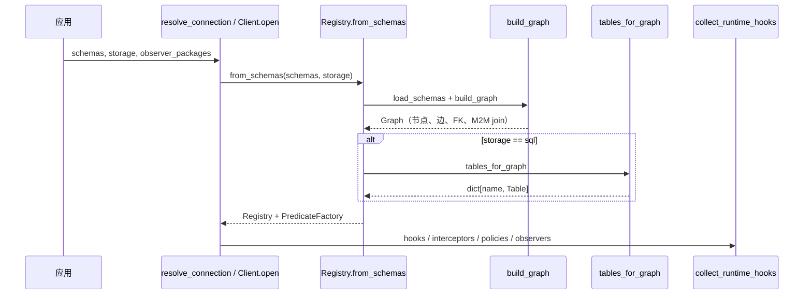
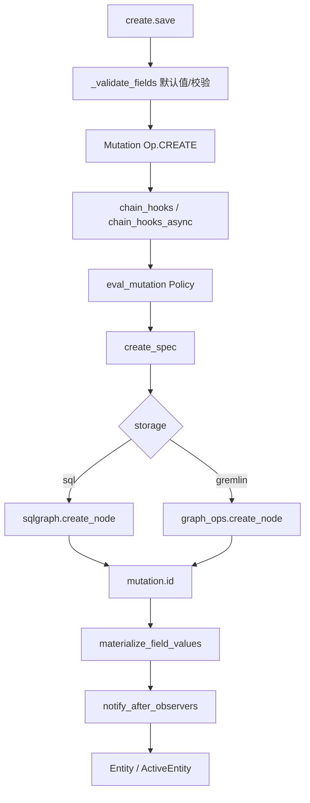
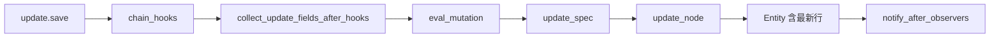
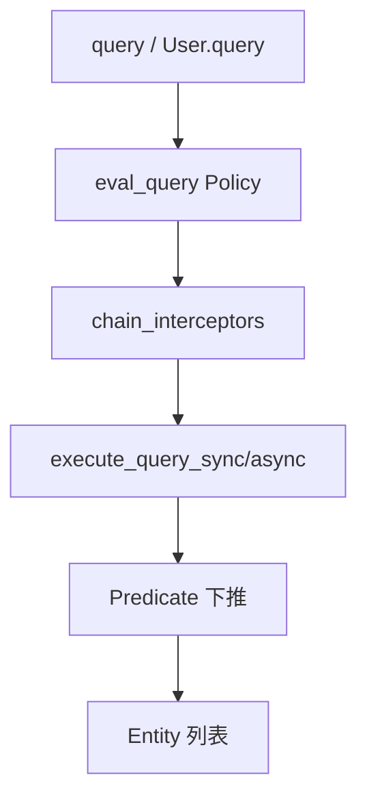
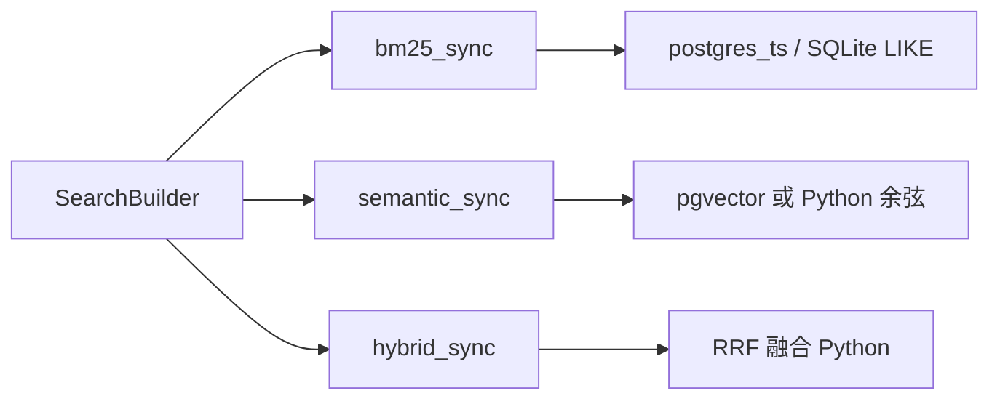
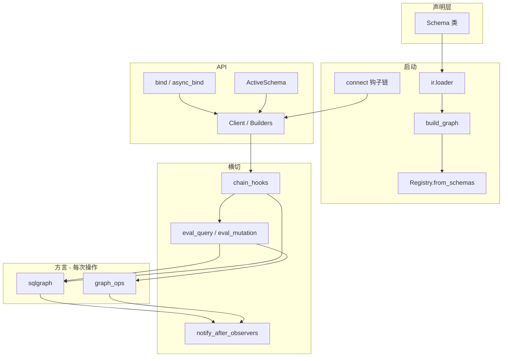

# entpy 架构设计与端到端执行流程

本文档描述 entpy 的分层架构、连接与编译启动流程、CRUD / 边遍历 / 检索的端到端路径，以及谓词如何下推为 SQL 或 Gremlin。内容以当前仓库实现为准。

---

## 1. 概述

entpy 是 **运行时优先（runtime-first）** 的实体框架：

- 用 Python 类声明 **Schema**（字段、边、索引、检索配置），启动时编译为中间表示（IR）。
- 通过 **`Client` / `AsyncClient`** 或 **`bind` / `async_bind`** 执行 CRUD、图遍历与全文 / 向量检索。
- **不生成 ORM 代码**；Schema 类即唯一数据源。

推荐业务入口为 **`entpy.active`**：`User.create()`、`User.query()`、`entity.out("knows").all()` 等，底层统一委托给 `Client` 与方言层。

---

## 2. 分层架构

```
┌──────────────────────────────────────────────────────────────────┐
│  声明层 (Declarative)                                             │
│  schema/     Field、Edge、BaseSchema、SearchMixin、Mixin @hook      │
├──────────────────────────────────────────────────────────────────┤
│  编译层 (IR)                                                      │
│  ir/         Schema → NodeDescriptor → Graph（表 / FK / M2M / 标签）│
├─────────────────────────────────────────────────────────────────┤
│  注册层 (Registry)                                                │
│  runtime/registry.py    Graph + SQLAlchemy Table + F() 工厂       │
├─────────────────────────────────────────────────────────────────┤
│  API 层                                                           │
│  active/     bind、ActiveSchema、ActiveEntity（ContextVar）        │
│  runtime/    Client、Builders、Predicate、Traverse、Mutation       │
├─────────────────────────────────────────────────────────────────┤
│  横切能力                                                         │
│  observer/   生命周期（自动发现，转 Hook 或后置回调）                  │
│  privacy/    Allow / Deny / Skip 策略链                           │
│  entql/      JSON 过滤器 → Predicate                              │
│  search/     BM25 / 语义 / RRF 混合                               │
├─────────────────────────────────────────────────────────────────┤
│  方言层 (Dialect)                                                 │
│  dialect/sqlalchemy/   sqlgraph、迁移、pgvector 类型               │
│  dialect/gremlin/      graph_ops、Gremlin 遍历                     │
└──────────────────────────────────────────────────────────────────┘
```

| 层 | 目录 | 职责 |
| --- | --- | --- |
| Schema | `entpy/schema/` | 字段 DSL、边、索引、`SearchMixin`、Mixin 级 `@hook` |
| IR | `entpy/ir/` | `load_schemas` → `build_graph` → `NodeDescriptor` / `ResolvedEdge` |
| Registry | `entpy/runtime/registry.py` | 持有 Graph、SQL 表元数据、每 Schema 的 `PredicateFactory`、边解析缓存 |
| Runtime | `entpy/runtime/` | CRUD Builder、谓词、遍历链、Hook、事务 session、连接钩子 |
| Active | `entpy/active/` | `bind` / `async_bind`；`ActiveSchema` / `ActiveEntity` 语法糖 |
| Observer | `entpy/observer/` | `creating` / `on_save` / `on_delete` 等 |
| Dialect | `entpy/dialect/` | SQLAlchemy 与 Gremlin 的实际 IO |
| Search | `entpy/search/` | 检索注册表、`SearchBuilder`、可插拔 BM25 后端 |

---

## 3. 启动：连接解析与 Schema 编译

应用启动分两步：**解析连接得到 Client**，再在 `Client.open` / `Registry.from_schemas` 时 **一次性编译 Schema**。

### 3.1 连接钩子（`entpy/runtime/connect.py`）

`bind` / `async_bind` 不直接拼 DSN，而是构造 `ConnectRequest`，经 **连接钩子链** 得到 `Client` 或 `AsyncClient`：

```
register_connection_hook(...)   # 用户全局钩子（可 prepend）
  → ExistingClientHook        # request.client 已存在
  → ConfigConnectionHook      # config dict 或 JSON 文件
  → EnvConnectionHook         # source="env" 或仅有 ENTPY_DSN
  → DsnConnectionHook         # request.dsn
```

| 方式 | 示例 |
| --- | --- |
| DSN | `bind("sqlite:///:memory:", schemas=SCHEMAS)` |
| 配置 | `bind(config={"dsn": "..."}, ...)`、`bind(config="db.json", ...)` |
| 环境变量 | `bind(schemas=..., source="env")`（`ENTPY_DSN`、`ENTPY_STORAGE`） |
| 已有 Client | `bind_client(app)`、`bind(client=app, owns_connection=False)` |
| 自定义 | `register_connection_hook(hook)` 或 `connection_hooks=[...]` |

**重要语义：**

- **同步 / 异步由 `bind` vs `async_bind` 决定**，配置或环境变量中的 `async` **不会**把 `bind()` 变成 `AsyncClient`（避免 `scope` / `close` 与 `ascope` / `aclose` 混用）。
- `bind(..., hooks=[...])` 在块内临时前置运行时 Hook，退出后恢复，**不会累积**到 Client 上。
- `resolve_connection(..., apply_runtime_hooks=True)` 用于 `Client.open_with`；`bind` 自行合并 `hooks` 且 `apply_runtime_hooks=False`，避免重复挂载。

演示项目通过 `examples/demos/common/connect.py` 的 `demo_bind` / `demo_bind_gremlin` 封装 `bind(config=...)`，配置文件位于 `examples/demos/config/*.json`。

### 3.2 Schema 编译（`Registry.from_schemas`）



编译产物：

| 产物 | 说明 |
| --- | --- |
| `Graph` | 节点、边类型（O2O / O2M / M2M）、FK 列、join 表 |
| `tables` | 仅 SQL：`UUID` 主键、`create_time` / `delete_time` 等 SQLAlchemy `Table` |
| `PredicateFactory` | 每 Schema 一个，供 `F(User).age.gt(18)` 使用 |
| `_edge_cache` | `(schema, edge_name) → ResolvedEdge`，加速遍历与 `with_()` |

---

## 4. Active 层与 Client

`ActiveSchema` **不重复实现**持久化，仅从 `ContextVar` 取当前 `Client` 并委托 Builder（`entpy/active/schema.py`）。

| Active API | 底层等价 |
| --- | --- |
| `User.create(name="x")` | `client.create(User, name="x").save()` |
| `User.query(age=18)` | `client.query(User).where(F(User).age.eq(18))` |
| `F(User)` | `get_bound_client().F(User)` |
| `entity.out("knows").out("knows").all()` | `TraverseChain` / `AsyncTraverseChain` |
| `ActiveEntity.save()` | 脏字段跟踪 + `client.update(...).save()` |

**约束：**

- 须在 `with bind(...):` 或 `async with async_bind(...):` 内使用，否则 `get_client()` / `get_async_client()` 抛错。
- **禁止** `bind` 与 `async_bind` 嵌套；`get_bound_client()` 在二者之一激活时可用。

### 4.1 Client 生命周期

| 场景 | 用法 | 行为 |
| --- | --- | --- |
| 脚本 / 测试 | `with bind(dsn, schemas=..., lifecycle="request"):`（默认） | 块内 `scope()`；退出时 `close()` / `aclose()` |
| Web / 长驻进程 | `app = Client.open(...)`；每请求 `with app.scope(ctx=...):` | 连接池进程内复用；`scope` 只切 ContextVar 与请求 `ctx` |
| 连接池绑定 | `with bind_client(app):` | 不 dispose engine；块内可挂临时 `hooks` |
| 显式释放 | `client.close()` / `await client.aclose()` | SQL `engine.dispose()`；Gremlin 关闭远程连接 |

### 4.2 请求上下文与事务

- **`scope(ctx=...)` / `ascope(ctx=...)`**：请求级 `ctx` 通过 ContextVar **叠加**到 `Client._ctx`（`get_effective_ctx`），不原地修改 `_ctx`，并发安全。
- **`client.transaction()` / `async with client.transaction():`**：块内写操作复用同一 ORM session，成功 commit、失败 rollback；实现见 `entpy/runtime/session_scope.py`，驱动 `session()` 在事务中返回复用 session。
- **默认无事务**：每次 Builder 操作独立 session + commit。

---

## 5. 谓词与 EntQL

**结论：会下推到数据库**，通过 SQLAlchemy 表达式或 Gremlin 遍历步骤编译，**不是**手写 SQL 字符串拼接。

### 5.1 谓词模型（`entpy/runtime/predicate.py`）

`F(User).age.gt(18)` 生成 `Predicate`，内含：

- `fn(table)` → SQLAlchemy `WHERE` 片段
- `gremlin_fn(t)` → Gremlin `.has()` 等步骤

当前 `FieldRef` 支持：`eq`、`ne`、`in_`、`gt`（尚未提供 `lt` / `gte` / `like` 等）。

### 5.2 查询下推路径

```
F(User).age.gt(18)
  → QueryBuilder → execute_query_sync / execute_query_async
  → [eval_query] → [chain_interceptors]
  → sql_preds = [p.apply(table) for p in preds]
  → sqlgraph.query_nodes / graph_ops.query_nodes
  → session.execute → Entity 列表
```

### 5.3 EntQL

`QueryBuilder.entql({"age": {"gt": 18}})` → `entql_to_predicates()`（`entpy/entql/filter.py`）→ 与 `where()` 相同下推。

### 5.4 不会自动下推的场景

| 场景 | 行为 |
| --- | --- |
| 任意 Python 过滤函数 | 不支持；须 `F()` / EntQL |
| `traverse().where(...)` 多跳过滤 | 收集邻居 id 后二次 `QueryBuilder`（混合） |
| Policy / Hook / Observer | 纯 Python |
| Hybrid RRF | Python 合并排名 |
| 无语义索引的语义检索 | 全表拉取向量 + Python 余弦 |

---

## 6. 写路径端到端

### 6.1 CREATE



| 步骤 | 位置 | Python / DB |
| --- | --- | --- |
| 默认值、validators | `CreateBuilder._validate_fields` | Python |
| 修改 fields / edges | `chain_hooks`（含 Observer `creating`） | Python |
| 权限 | `eval_mutation` | Python |
| INSERT + 边 | `sqlgraph` / `graph_ops` | DB |
| 后置 | `notify_after_observers`（`on_save` 等） | Python |

SQL 边写入：M2M 写 join 表（SQLite / PG 支持 `ON CONFLICT DO NOTHING` 幂等）；O2M / O2O 更新对端 FK。

**Update 边 API：**

| 方法 | 语义 |
| --- | --- |
| `add(edge, *ids)` | **追加**（M2M 幂等插入；与改前行为一致） |
| `set_edges(edge, *ids)` | 仅 **M2M**：保存后该边集合 **恰好** 为 `ids`（可先 `set_edges` 再 `add` 合并为同一 save 的最终列表）；空参数清空关联 |
| O2O | 无 `set_edges`；Update 时 **独占替换**（先解除旧 FK 再绑定新 peer） |

### 6.2 UPDATE



| 步骤 | 说明 |
| --- | --- |
| Hook 可改 `mutation.fields` | 仅 **显式 `set()` 的列** + `SearchMixin` 的 **vector 字段**（如 `embed_on_save_hook`）会落库 |
| SQL 返回行 | `sqlgraph.update_node` 优先 `UPDATE ... RETURNING`，不支持时 UPDATE 后 SELECT |
| Gremlin 返回行 | `graph_ops.update_node`：`property(...).valueMap(True)` 同链返回，**不再**单独 `get_by_id` |
| 边更新 | `update_spec` 中的 `EdgeSpec` 在写列之后应用 |

`ActiveEntity.save()` 仅提交 **脏字段**；JSON 字段通过快照比对检测原地修改（`metadata["k"]=...`）。

### 6.3 DELETE

| 模式 | 行为 |
| --- | --- |
| `delete(Schema).one(id).execute()` | 按 id 删除；`count==0` 不触发 `on_delete` |
| `delete(Schema).where(F(...)).execute()` | **直接** `DELETE ... WHERE` 下推，**不**先 SELECT 全表 |
| `one(id)` 与 `where()` 并用 | `ValueError` |

流程：`deleting` Hook → `eval_mutation` → `delete_nodes` → `count > 0` 时 `notify_after_observers`。

---

## 7. 读路径端到端（QUERY）



| 步骤 | Python / DB |
| --- | --- |
| `eval_query` | Python（DB 前） |
| Interceptor | Python（可改 limit、with_edges 等） |
| `p.apply(table)` / `apply_gremlin` | 编译为 SQL / Gremlin |
| `with_("cars")` | DB（`load_neighbors_sql_batch` 批量加载） |

读路径 **不经过** Observer 前置 Hook；无 `on_save`。

---

## 8. 边遍历（TRAVERSE）

入口：`entity.out("edge")` 或 `client.traverse(entity, "edge")` → `TraverseChain` / `AsyncTraverseChain`（`entpy/runtime/traverse.py`）。

| 模式 | 实现 | 下推 |
| --- | --- | --- |
| SQL / Gremlin 单跳 | `load_neighbors_sql` / `traverse_neighbors` | DB |
| Gremlin 多跳（无 `where`） | `graph_ops.traverse_chain` | DB |
| SQL 多跳（无 `where`，≥2 跳） | `traverse_chain_sql`（`edge_joinable_sql` 逐跳可 JOIN） | DB |
| SQL 多跳不可 JOIN 或 JOIN 失败 | `_hop_neighbors_batch` 逐跳；`ValueError` 自动回退 | Python |
| 带 `where()` | 邻居 id → 二次 `QueryBuilder` | 混合 |
| `values("field")` | 投影字段列表 | 视 fast path 而定 |

**异步：** `async_bind` 下 `await entity.out("knows").all()`；SQL 异步驱动使用 `AsyncTraverseChain` 与 `sqlgraph_async`。

**边可 JOIN 判定：** `edge_joinable_sql` — M2M 须有 `join_table`；否则须有 `fk_columns`。`can_traverse_chain_sql` 要求链上每一跳均可 JOIN。

---

## 9. 检索（SEARCH）



| 方法 | 下推 | 说明 |
| --- | --- | --- |
| `bm25_sync` | DB | PG `ts_rank` 或 SQLite `LIKE` 降级 |
| `semantic_sync` | DB 或 Python | 有 pgvector 用距离排序；否则内存余弦 |
| `hybrid_sync` | 混合 | 两路召回 + RRF |
| `reindex` | 混合 | 全表 query → embed → batch update |

检索配置来自 `SearchMixin.search_config()`，由 `SearchRegistry` 解析；与 CRUD 共用 `Client`。

**写入时 Embedding：** `embed_on_save_hook(embedder)` / `embed_on_save_async_hook`（`entpy/runtime/hooks/embed_on_save.py`），在 `chain_hooks` 内写入向量列；`EmbedAdapter` 统一 `embed_sync` / `embed`、可调用对象与 `callable_embedder`。

---

## 10. 横切关注点

### 10.1 运行时 Hook 组装

```
Client.open_with(hooks=...)
  + Schema / Mixin @hook
  + observers_to_hooks()（仅 creating / updating / deleting）
```

**变更顺序：**

```
1. _validate_fields          [CREATE]
2. Mutation
3. chain_hooks / chain_hooks_async   ← 持久化前，洋葱模型
4. eval_mutation             ← Policy
5. create_spec / update_spec / delete_spec
6. sqlgraph / graph_ops      ← DB
7. notify_after_observers    ← 持久化后（on_save / on_delete）
```

- **同步链：** 仅 `Hook`；`AsyncHook` 会 `TypeError`。
- **异步链：** `AsyncHook` 原生 `await`；`Hook` 按粒度 `asyncio.to_thread`；同步 Hook 内需 `await` 后续 AsyncHook 时用 `_run_coro_sync`（已有 event loop 时在新线程执行）。

### 10.2 Observer

- **前置：** `creating` / `updating` / `deleting` → 转为 Hook，可改 `mutation.fields` / `edges`。
- **后置：** `created` / `updated` / `deleted` / `on_save` / `on_delete` 在 Hook 链**之外**调用。

`bind(schemas=...)` 从 `models` 包推断并扫描并列的 `observers` 包；模型文件 **无需** import Observer。

### 10.3 Privacy（`entpy/privacy/policy.py`）

| 行为 | 说明 |
| --- | --- |
| 默认 | **fail-open**（无规则匹配则放行） |
| `Policy(deny_by_default=True)` | fail-closed |
| `mutation_rule()` / `query_rule()` | 读写规则分离 |
| `rule()` | `mutation_rule` 别名，仅写路径 |
| 多 Policy | 任一 Policy 内 `Allow` 即通过该 Policy；`Deny` 抛 `NotAllowedError` |

### 10.4 Interceptor

查询路径：`eval_query` → `chain_interceptors` → `execute_query_*`；同步与异步共用拦截器接口。

---

## 11. Python 运行时 vs 数据库下推

| 留在 Python | 下推到 DB |
| --- | --- |
| 默认值、validators、脏字段跟踪 | INSERT / UPDATE / DELETE |
| Hook / Observer / Policy | WHERE（Predicate） |
| Traverse 带 `where` 的二次过滤 | 单跳邻居、Gremlin / SQL 多跳 fast path |
| Hybrid RRF、非 PG 语义暴力相似度 | BM25、pgvector 距离 |
| Interceptor、Entity 封装 | `with_()` 批量边加载 |
| 按谓词删除（直接 DELETE WHERE） | M2M join、O2M FK 更新 |

---

## 12. 运行时能力一览

框架内置以下能力，业务代码通常 **无需** 自管 session 粒度、双套遍历 API 或连接释放细节。

| 类别 | 能力 |
| --- | --- |
| **连接** | 连接钩子链；`bind` / `async_bind` 类型校验；块级 `hooks` 不累积 |
| **事务** | `transaction()` 块内 session 复用 |
| **遍历** | 链式 `.out()`；SQL JOIN 多跳 + 复杂边回退；Gremlin 多跳 fast path |
| **写优化** | SQL `RETURNING`；Gremlin 单次 `valueMap` 返回；按谓词删除 |
| **读优化** | `load_neighbors_sql_batch`（async 原生 `await execute`）；Gremlin `load_edge_neighbors_batch`；query `with_()` 异步预加载不再整段 `run_sync`；Registry 边解析缓存 |
| **异步** | `AsyncClient`、`chain_hooks_async`、`execute_query_async`；`sqlgraph_async.query_nodes` 原生 `await execute` |
| **检索** | PostgreSQL 需 pgvector；SQLite 仅 `allow_brute_fallback` 开发态；`reindex` 分页 + `batch_update_fields` |
| **边更新** | `add()` 追加；`set_edges()` M2M 全量替换（`EdgeSpec.replace`）；O2O Update 独占替换；`QueryRequest.predicates` 传入拦截器 |
| **数据健壮性** | JSON / dict / list 深拷贝与脏检测；`id=str(uuid)` 不可变 noop；`merge_mutation` 边列表去重；`Entity` 剥离 `_edges` 出 `_data` |
| **检索** | `embed_on_save_hook` 对接外部 Embedding API |
| **规范** | 未知边名 `ValueError`；`create_spec` / `update_spec` 校验 |

---

## 13. 端到端数据流



---

## 14. 关键模块索引

| 用途 | 路径 |
| --- | --- |
| Schema / BaseSchema | `entpy/schema/base.py`, `field.py`, `edge.py`, `search.py` |
| IR 编译 | `entpy/ir/loader.py`, `graph.py`, `descriptor.py`, `policies.py` |
| 连接钩子 | `entpy/runtime/connect.py` |
| 注册表 | `entpy/runtime/registry.py` |
| Client / 事务 | `entpy/runtime/client.py`, `async_client.py`, `session_scope.py` |
| CRUD Builder | `entpy/runtime/builders.py`, `builders_async.py` |
| 查询执行 | `entpy/runtime/query_exec.py`, `query_helpers.py` |
| 谓词 | `entpy/runtime/predicate.py` |
| Spec | `entpy/runtime/spec_helpers.py` |
| 校验 / 脏字段 | `entpy/runtime/validation.py` |
| 遍历 | `entpy/runtime/traverse.py`, `traverse_core.py`, `traverse_exec.py`（快路径 + filter + 多跳慢路径 + `run_all_*`） |
| Hook | `entpy/runtime/hook.py`, `hooks/embed_on_save.py` |
| Interceptor | `entpy/runtime/interceptor.py`（`AsyncInterceptor` + `chain_interceptors_async`） |
| Observer | `entpy/observer/hooks.py`, `discovery.py`, `integration.py` |
| Policy | `entpy/privacy/policy.py` |
| Active | `entpy/active/bind.py`, `schema.py`, `entity.py`, `context.py` |
| SQL 方言 | `entpy/dialect/sqlalchemy/sqlgraph.py`, `sqlgraph_async.py`, `metadata.py` |
| Gremlin 方言 | `entpy/dialect/gremlin/graph_ops.py`, `driver.py` |
| 检索 | `entpy/search/builder.py`, `registry.py`, `embed_provider.py` |
| EntQL | `entpy/entql/filter.py` |
| 演示连接封装 | `examples/demos/common/connect.py` |

---

## 15. 集成模式与结论

### 15.1 FastAPI（同步 Client + 请求 scope）

```python
app_client = Client.open(DSN, schemas=SCHEMAS)

@app.middleware("http")
async def entpy_ctx(request, call_next):
    with app_client.scope(ctx={"user_id": request.state.user_id}):
        return await call_next(request)

# 进程退出：app_client.close()
```

异步 IO 应用可对写路径使用 `async_bind` + `AsyncClient`，Gremlin 调用经 `driver.run` 包装。

### 15.2 核心结论

1. **架构**：声明式 Schema → IR Graph → Registry → Builder → Dialect；Active 是 Client 的语法糖。
2. **连接**：可插拔连接钩子；`bind` / `async_bind` 严格区分同步与异步 Client。
3. **谓词**：`F()` / EntQL **会下推**为 SQLAlchemy `WHERE` 或 Gremlin `has()`，由驱动生成最终语句。
4. **写路径**：Hook（含 Observer 前置）→ Policy → Spec → DB → 物化字段 → Observer 后置。
5. **读路径**：Policy → Interceptor → 谓词下推 → DB → `Entity`；可选 `with_()` 预加载边。
6. **遍历与检索**：多跳与混合检索在框架内选择 fast path 或 Python 回退，对调用方 API 保持一致。

更多可运行示例见 `examples/start/`、`examples/demos/`（五类演示）与 `examples/rag/`。
